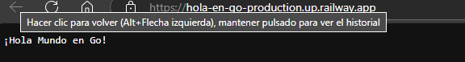

# hola-en-go
# About the Project  
The "Hello World" project in Go is a beginner-friendly example that demonstrates how to create, compile, and run a basic Go application. This type of project is typically used as a stepping stone to learn a new programming language, helping developers understand the fundamental syntax and structure of Go.

## Table of Contents  
- About the Project  
- Overview  
- Features  
- Built With  
- Getting Started  
- Prerequisites  
- Installation  
- Configuration  
- Running the Service  
- Running with Docker   

## Overview  
This project is a simple "Hello World" application written in the Go programming language. Its purpose is to provide newcomers with a basic understanding of a Go program's structure, from setup to execution.

## Features  
- **Simple Setup**: Quick installation and configuration, making it perfect for beginners.  
- **Basic Structure**: Contains a main function that prints "Hello, World!" to the console, showcasing Go's syntax.  
- **Learning Foundation**: Offers a base for diving into more advanced Go applications and features.

## Built With  
- Docker  
- Go

## Getting Started  
### Prerequisites  
Before you begin, ensure that the following tools are installed on your machine:  
- Golang version 1.23.0 or later – [Download Golang](https://golang.org/dl/)

If any of these tools are missing, use the provided links to install them.

### Installation  
1. Clone the repository:  
   ```bash
   https://github.com/XavierQu23/hola-en-go.git

Build the project:
go build main.go
Running the Service
To run the service:
go run main.go

Then, open a browser and visit:
localhost:8001

Running with Docker
Pull or build the Docker image:
docker pull xavi1920/holaengo:latest  
docker build -t <any-name> .

docker run -p 8001:8001 xavi1920/holaengo:version2  # or <any-name>

# RESULTS


https://hola-en-go-production.up.railway.app/

